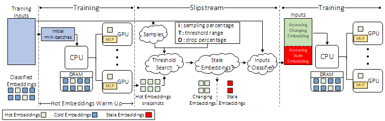

# Slipstream - Towards Embedding Variation Aware Recommender Model Training

<br>
<div style="text-align: center; margin: 20pt">
  <figcaption style="font-style: italic;"></figcaption>
</div>

This repository contains the Slipstream framework implementation for accelerating recommendation models training.

Dataset Pre-processing
----------------------
Publicly available datasets (Criteo Kaggle, Criteo Terabyte, Avazu, Taobao etc) can be downloaded and required pre-processing for training.

Follow below steps for downloading raw datasets and then pre-processing the required dataset for training purpose.

```
     cd Slipstream

```
1) The code supports interface with the [Criteo Kaggle Display Advertising Challenge Dataset](https://labs.criteo.com/2014/02/kaggle-display-advertising-challenge-dataset/).
   - Please do the following to prepare the dataset for use with DLRM code:
     - First, specify the raw data file (train.txt) as downloaded with --raw-data-file=<./input/kaggle/train.txt>
     - This is then pre-processed (categorize, concat across days...) to allow using with dlrm code
     - The processed data is stored as *.npz file in ./input/kaggle/*.npz
     - The processed file (*.npz) can be used for subsequent runs with --processed-data-file=<./input/kaggle/*.npz>
   - Criteo kaggle can be pre-processed using the following script
     ```
     ./bench/dlrm_s_criteo_kaggle.sh
     ```

2) The code supports interface with the [Criteo Terabyte Dataset](https://labs.criteo.com/2013/12/download-terabyte-click-logs/).
   - Please do the following to prepare the dataset for use with DLRM code:
     - First, download the raw data files day_0.gz, ...,day_23.gz and unzip them
     - Specify the location of the unzipped text files day_0, ...,day_23, using --raw-data-file=<./input/terabyte/day> (the day number will be appended automatically)
     - These are then pre-processed (categorize, concat across days...) to allow using with dlrm code
     - The processed data is stored as *.npz file in ./input/terabyte/*.npz
     - The processed file (*.npz) can be used for subsequent runs with --processed-data-file=<./input/terabyte/*.npz>
   - Criteo Terabyte can be pre-processed using the following script
    ```
      ./bench/dlrm_s_criteo_terabyte.sh
    ```

Running DLRM Baseline
----------------------

DLRM baseline can be run on a hybrid CPU-GPU system using following script
```
     ./run_dlrm_baseline.sh
```

Input Segregation - Hot/Cold
-----------------------------

Input training dataset requires to be segregated into hold and cold inputs and hot and cold embeddings required for Slipstream.  Based on available GPU memory for hot embedding entries, $\Lambda$ parameter is selected that defines if an embedding entry is popular or not -- based on embeddings access frequency and further training dataset is segregated into hot and cold inputs.

Input segregation can be executed on a CPU system using following script
```
     ./run_input_segregation.sh
```

Running FAE Baseline
---------------------

FAE baseline can be run on a hybrid CPU-GPU system using following script
```
     ./run_fae_baseline.sh
```

Running Slipstream
-------------------

Slipstream identifies the stale embeddings via threshold ($T$) found automatically based on the target drop percentage ($D$) along with certain additional parameters like $\alpha$, which determines the condition under which an input is dropped given the number of accessed embeddings by input are stale.

Slipstream can be run on a hybird CPU-GPU system using following script
```
     ./run_slipstream.sh
```

Requirements
-------------

This project requires **Python** $\geq 3.7$, with below dependencies.

pytorch

scikit-learn

numpy

pandas

onnx (*optional*)

pydot (*optional*)

torchviz (*optional*)

tqdm

cPickle


License
-------
This source code is licensed under the MIT license found in the
LICENSE file in the root directory of this source tree.


